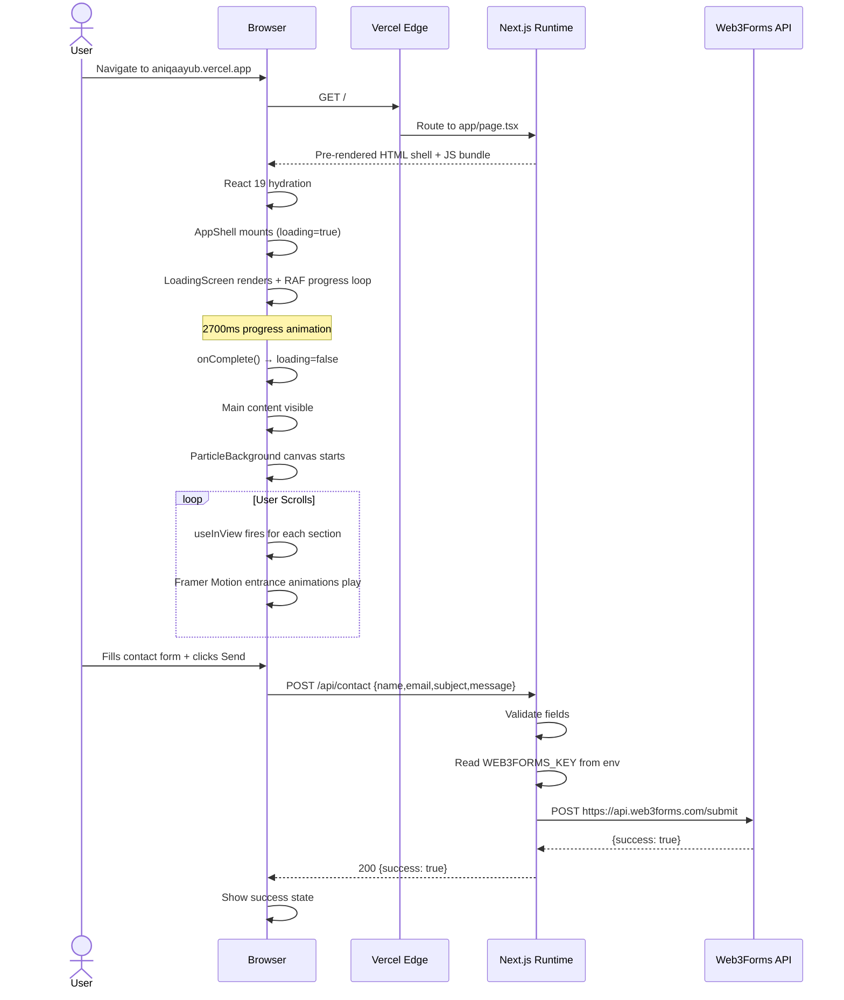
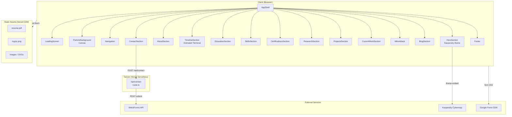
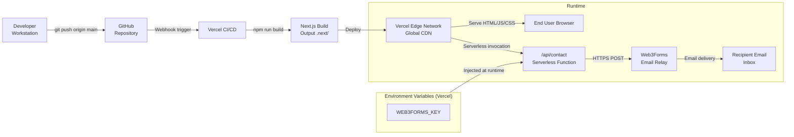

# Aniqa Ayub — Cybersecurity Portfolio

> **Enterprise-level technical documentation for software engineers, researchers, and employers.**

[](https://nextjs.org)
[](https://react.dev)
[](https://www.typescriptlang.org)
[](https://tailwindcss.com)
[](https://www.framer.com/motion)
[](https://aniqaayub.vercel.app)

---

## Table of Contents

1. [Executive Summary](#1-executive-summary)
2. [System Overview](#2-system-overview)
3. [Functional Overview](#3-functional-overview)
4. [Technology Stack](#4-technology-stack)
5. [Repository Structure](#5-repository-structure)
6. [Software Architecture](#6-software-architecture)
7. [Component Documentation](#7-component-documentation)
8. [Workflow](#8-workflow)
9. [Installation Guide](#9-installation-guide)
10. [Configuration](#10-configuration)
11. [Environment Variables](#11-environment-variables)
12. [Build Process](#12-build-process)
13. [Deployment](#13-deployment)
14. [Security Features](#14-security-features)
15. [Error Handling](#15-error-handling)
16. [Performance Considerations](#16-performance-considerations)
17. [Scalability](#17-scalability)
18. [Limitations](#18-limitations)
19. [Future Improvements](#19-future-improvements)
20. [API Documentation](#20-api-documentation)
21. [Database Documentation](#21-database-documentation)
22. [Folder-by-Folder Explanation](#22-folder-by-folder-explanation)
23. [Code Flow](#23-code-flow)
24. [Sequence Diagram](#24-sequence-diagram)
25. [Architecture Diagram](#25-architecture-diagram)
26. [Deployment Diagram](#26-deployment-diagram)
27. [Conclusion](#27-conclusion)

---

## 1. Executive Summary

### Purpose

This repository contains the complete source code for **Aniqa Ayub's professional cybersecurity portfolio** — a production-grade, single-page web application designed to present her identity, expertise, research, and career trajectory to recruiters, collaborators, and the broader security community.

### Problem Statement

Generic portfolio templates and LinkedIn profiles do not adequately convey the depth of a cybersecurity researcher's technical proficiency. They lack interactive demonstrations of domain knowledge, fail to present research in a structured manner, and provide no mechanism for qualified visitors to initiate professional contact directly from the portfolio.

### Objectives

| # | Objective |
|---|-----------|
| 1 | Present professional identity, roles, and career timeline in a visually compelling format |
| 2 | Demonstrate hands-on expertise across SIEM engineering, penetration testing, threat intelligence, and AI security |
| 3 | Surface academic research papers, active projects, and MITRE ATT&CK framework coverage |
| 4 | Provide a fully functional contact system backed by a server-side API route |
| 5 | Achieve maximum search-engine discoverability through structured metadata and JSON-LD |
| 6 | Deliver a performant, accessible, responsive experience across all device classes |

---

## 2. System Overview

The application is a **Next.js 16 single-page application (SPA)** deployed on Vercel's edge infrastructure. It consists of:

- A **React 19 client-side rendering layer** responsible for all interactive UI, animations, and section components.
- A **Next.js App Router API route** (`/api/contact`) that handles server-side form submission via the Web3Forms email relay service.
- A **static asset layer** served from the `/public` directory (images, resume PDF, SVG icons).
- A **comprehensive SEO layer** defined in the root layout, including Open Graph metadata, Twitter cards, and JSON-LD structured data (Schema.org `Person` and `WebSite` types).

There is no relational or document database. All portfolio content is authored directly in TypeScript source files as typed constants.

---

## 3. Functional Overview

| Section | User-Facing Feature |
|---------|-------------------|
| Loading Screen | Animated SVG network topology with progress counter; auto-dismisses after ~2.7 s |
| Navigation | Fixed header with smooth-scroll anchor links; mobile hamburger menu |
| Hero | Full-viewport with live Kaspersky Cybermap iframe; name, roles, CTA buttons |
| About | Professional biography, three focus-area cards, key information grid |
| Professional Timeline | Hex-grid background; animated terminal emulator types `whoami` and `./skills.sh` on scroll |
| Education | Three academic credential cards with course detail |
| Skills | Five skill category matrices with animated proficiency bars |
| Certifications | Completed and in-progress certification cards with status badges |
| Research | Three research paper cards with tab-based status filtering |
| Projects | Six security case-study cards with hover interaction |
| Current Work | Four active project cards with progress bars and milestone trackers |
| MITRE ATT&CK | Ten tactic cards with technique lists and proficiency indicators |
| Blog | Six technical post cards with category filtering |
| Contact | Left-column contact methods + right-column validated form backed by `/api/contact` |
| Footer | Branding, social links, resume download |

---

## 4. Technology Stack

### Programming Languages

| Language | Version | Role |
|----------|---------|------|
| TypeScript | `^5.x` | Primary language for all source files |
| JavaScript | ES2017 target | Compiled output via TypeScript |
| CSS | Custom properties + Tailwind 4 | Styling and animations |

### Frameworks

| Framework | Version | Role |
|-----------|---------|------|
| Next.js | `16.2.9` | Full-stack React framework; App Router; server API routes |
| React | `19.2.4` | UI rendering; concurrent features |
| React DOM | `19.2.4` | DOM binding for React |

### Libraries

| Library | Version | Role |
|---------|---------|------|
| Framer Motion | `^12.40.0` | Declarative animations (`motion`, `useInView`, `AnimatePresence`) |
| Lucide React | `^1.17.0` | SVG icon library (Lock, Shield, Target, Mail, etc.) |
| Tailwind CSS | `^4.x` | Utility-first CSS framework with PostCSS integration |

### APIs & Third-Party Services

| Service | Purpose |
|---------|---------|
| **Web3Forms** (`https://api.web3forms.com/submit`) | Server-side email relay for the contact form |
| **Kaspersky Cybermap** (iframe embed) | Live global threat intelligence visualization in Hero section |
| **Google Fonts** (`next/font/google`) | Geist Sans and Geist Mono typefaces loaded at build time |

### Databases

None. All data is statically authored in TypeScript source files.

### Cloud Services

| Service | Role |
|---------|------|
| **Vercel** | Hosting, edge deployment, automatic CI/CD on `git push` |

### Build Tooling

| Tool | Version | Role |
|------|---------|------|
| `@tailwindcss/postcss` | `^4.x` | PostCSS plugin for Tailwind CSS 4 |
| ESLint | `^9.x` | Code quality; flat config with `eslint-config-next` |
| `eslint-config-next` | `16.2.9` | Next.js-specific lint rules (core web vitals + TypeScript) |

---

## 5. Repository Structure

```
cyber-portfolio/
│
├── app/                          # Next.js App Router root
│   ├── layout.tsx                # Root layout: fonts, metadata, JSON-LD, global styles
│   ├── page.tsx                  # Entry page — renders <AppShell />
│   ├── globals.css               # Global CSS: Tailwind directives, custom keyframes, utilities
│   └── api/
│       └── contact/
│           └── route.ts          # POST /api/contact — Web3Forms relay
│
├── components/                   # All React components
│   │
│   ├── AppShell.tsx              # Root client component; loading state; section order
│   ├── LoadingScreen.tsx         # Animated SVG overlay with progress bar
│   ├── ParticleBackground.tsx    # Canvas-based particle system (background layer)
│   ├── Navigation.tsx            # Fixed header with anchor links and mobile menu
│   ├── ScrollProgress.tsx        # Top-of-page scroll indicator (exists; not in AppShell)
│   │
│   ├── HeroSection.tsx           # Full-viewport hero with Kaspersky iframe
│   ├── AboutSection.tsx          # Bio, focus areas, key information grid
│   ├── TimelineSection.tsx       # Career timeline with animated terminal
│   ├── EducationSection.tsx      # Academic credentials
│   ├── SkillsSection.tsx         # Skill category matrices with progress bars
│   ├── CertificationsSection.tsx # Completed and in-progress certifications
│   ├── ResearchSection.tsx       # Research papers with tab filtering
│   ├── ProjectsSection.tsx       # Security case studies
│   ├── CurrentWorkSection.tsx    # Active projects with progress and milestones
│   ├── MitreAttack.tsx           # MITRE ATT&CK tactic and technique coverage
│   ├── BlogSection.tsx           # Technical blog post cards
│   ├── ContactSection.tsx        # Contact methods + validated form
│   ├── Footer.tsx                # Site footer
│   │
│   └── (unused — authored but not rendered in AppShell):
│       ├── ResearchLabSection.tsx
│       ├── PublicationsSection.tsx
│       ├── FloatingTerminalNav.tsx
│       ├── TerminalWidget.tsx
│       ├── MetricsDashboard.tsx
│       ├── ThreatMap.tsx
│       ├── ThreatRadar.tsx
│       ├── AttackMap.tsx
│       ├── ThreatLandscape.tsx
│       ├── MissionSection.tsx
│       └── GitHubSection.tsx
│
├── public/                       # Statically served assets
│   ├── resume.pdf                # Downloadable CV
│   ├── mypic.png                 # Profile photo (also used as OG image, 1200×630)
│   ├── cybersecurityanalyst.png  # Background image for Skills section
│   ├── loading.png               # Legacy loading asset
│   ├── professiontimeline.png    # Legacy timeline background
│   ├── hacker.webp               # Compressed image asset
│   ├── bg.webm                   # Video file (currently unused)
│   ├── 2.jpg                     # Image asset
│   └── *.svg                     # Next.js default SVG icons
│
├── next.config.ts                # Next.js configuration (default — no custom options)
├── tsconfig.json                 # TypeScript compiler configuration
├── postcss.config.mjs            # PostCSS with @tailwindcss/postcss plugin
├── eslint.config.mjs             # ESLint flat config
├── .env.local.example            # Environment variable template
├── AGENTS.md                     # Internal developer notes
├── CLAUDE.md                     # References AGENTS.md
└── package.json                  # Dependency manifest and npm scripts
```

---

## 6. Software Architecture

### Frontend

The entire frontend is a **React 19 client-side application** composed of modular section components. Each section is a self-contained `"use client"` module that manages its own animation state using Framer Motion's `useInView` hook. Sections animate on entry into the viewport and (where configured) reverse on exit.

The design language is a **dark cybersecurity aesthetic**:
- Background: `#020810` (near-black)
- Primary accent: `#38a532` (neon green)
- Typography: Geist Sans (body) + Geist Mono (code, labels, badges)
- Glassmorphism cards: `rgba(2,8,16,0.7–0.88)` with `backdrop-filter: blur(16–28px)`

### Backend

The only server-side logic resides in one API route:

```
app/api/contact/route.ts  →  POST /api/contact
```

This route validates the form payload, retrieves `WEB3FORMS_KEY` from environment variables, and forwards the submission to Web3Forms' public API endpoint. All other pages and sections are statically rendered at build time with no server-side data fetching.

### Database

**None.** All portfolio content (timeline entries, skill definitions, research papers, project descriptions, blog posts, MITRE tactics) is authored as typed TypeScript constants within the relevant component files. This eliminates runtime database dependencies, simplifies deployment, and ensures zero latency for content retrieval.

### Authentication

**None.** The portfolio is a public-facing, read-only application. The contact form relies on Web3Forms server-side validation and rate limiting. No user sessions, tokens, or protected routes exist.

### API Layer

| Route | Method | Handler |
|-------|--------|---------|
| `/api/contact` | `POST` | `app/api/contact/route.ts` |

All other network requests originate from the client:
- Kaspersky Cybermap loaded via `<iframe>` in HeroSection (no CORS involvement)
- Google Fonts loaded via Next.js font optimization at build time

### Data Flow

```
User fills contact form
    │
    ▼
ContactSection.tsx (client) validates presence of name/email/message
    │
    ▼
fetch POST /api/contact  (JSON body: { name, email, subject, message })
    │
    ▼
app/api/contact/route.ts (Next.js server)
    ├── Validates required fields
    ├── Reads WEB3FORMS_KEY from process.env
    └── POST https://api.web3forms.com/submit
            │
            ▼
        Web3Forms API delivers email to configured recipient
            │
            ▼
        JSON { success: true } → back to client
    │
    ▼
ContactSection shows success or error state
```

### Storage

- **Static assets** are served from `/public` via Vercel's CDN.
- **Resume PDF** (`/public/resume.pdf`) is linked directly as a download.
- No cloud object storage (S3, GCS, etc.) is used.

### Services

| Service | Integration Point | Purpose |
|---------|------------------|---------|
| Vercel | Git push → automatic deploy | Hosting and edge runtime |
| Web3Forms | `/api/contact` route | Email delivery |
| Kaspersky Cybermap | HeroSection iframe | Live threat visualisation |
| Google Fonts | `app/layout.tsx` via `next/font` | Self-hosted font serving |

---

## 7. Component Documentation

### AppShell

| Attribute | Detail |
|-----------|--------|
| **Purpose** | Root client component; controls loading gate and section render order |
| **Responsibilities** | Manages `loading` boolean state; renders LoadingScreen overlay; hides main content until loading completes |
| **Inputs** | None (top-level component) |
| **Outputs** | Full page DOM tree |
| **Dependencies** | All section components, LoadingScreen, ParticleBackground, Navigation, Footer |
| **Interactions** | Passes `onComplete` callback to LoadingScreen; sets `loading = false` on completion; toggles `visibility` on `<main>` |

---

### LoadingScreen

| Attribute | Detail |
|-----------|--------|
| **Purpose** | Animated full-screen overlay displayed on first page load |
| **Responsibilities** | Runs a 2700 ms RAF-based progress counter; renders SVG network topology on right panel; exits with opacity fade |
| **Inputs** | `onComplete: () => void` |
| **Outputs** | Fixed-position overlay (z-index 200) |
| **Dependencies** | React `useState`, `useEffect`; inline SVG; CSS keyframes (`ls-scan`, `ls-fade-up`, `ls-glow-pulse`) |
| **Interactions** | Calls `onComplete` at ~900 ms after progress reaches 100%; AppShell removes it from DOM |

**SVG Network Topology**: 15 pre-defined nodes (FIREWALL, IDS/IPS, ENDPOINT, SIEM, SOC, CLOUD + outer perimeter nodes) with 27 edges. 12 animated data packets traverse edge paths via `<animateMotion>`. Central node renders a shield-with-checkmark icon surrounded by dual pulsing rings.

---

### ParticleBackground

| Attribute | Detail |
|-----------|--------|
| **Purpose** | Ambient animated background layer across the entire page |
| **Responsibilities** | Manages a 80-particle canvas system; draws connecting lines between nearby particles; handles window resize |
| **Inputs** | None |
| **Outputs** | Fixed `<canvas>` element (z-index 0, pointer-events: none) |
| **Dependencies** | React `useRef`, `useEffect`; browser Canvas 2D API |
| **Interactions** | None — purely visual |

Particle parameters: random position and velocity, radius 1–2 px, green accent colour with varying opacity. Connection threshold: 110 px Euclidean distance. Particles wrap around viewport edges.

---

### Navigation

| Attribute | Detail |
|-----------|--------|
| **Purpose** | Fixed site header with smooth-scroll anchor navigation |
| **Responsibilities** | Detects scroll depth; applies glassmorphic background after 20 px; highlights active section; renders hamburger menu on mobile |
| **Inputs** | None |
| **Outputs** | Fixed `<header>` (z-index 50) |
| **Dependencies** | React `useState`, `useEffect`; Lucide `Lock` icon |
| **Interactions** | Smooth-scrolls to section IDs on anchor click; mobile menu toggled by hamburger button |

**Nav anchors**: `about`, `timeline`, `education`, `skills`, `projects`, `research`, `blog`, `contact`

---

### HeroSection

| Attribute | Detail |
|-----------|--------|
| **Purpose** | Full-viewport hero establishing professional identity |
| **Responsibilities** | Renders Kaspersky Cybermap iframe; displays name, role tags, CTA buttons; tracks mouse for glow effect |
| **Inputs** | None |
| **Outputs** | `<section>` with full-vh height |
| **Dependencies** | Framer Motion (`motion.div`); Lucide (`Download`, `Mail`); `useEffect` for mouse tracking |
| **Interactions** | "Download Resume" links to `/resume.pdf`; "Contact Me" opens `mailto:aniqaayub0fficial@gmail.com` |

---

### AboutSection

| Attribute | Detail |
|-----------|--------|
| **Purpose** | Professional biography and competency overview |
| **Responsibilities** | Renders two-column layout with bio text, three focus-area cards, and a key information glass panel |
| **Inputs** | None |
| **Outputs** | `<section id="about">` |
| **Dependencies** | Framer Motion; Lucide (`Server`, `Target`, `Shield`, `ChevronRight`); `useInView` |
| **Interactions** | Scan-line animation on key information panel; all content animates on viewport entry |

---

### TimelineSection

| Attribute | Detail |
|-----------|--------|
| **Purpose** | Career journey with animated terminal emulator |
| **Responsibilities** | Renders precomputed SVG hex grid background; orchestrates terminal typing animation sequence; renders timeline entry cards |
| **Inputs** | None |
| **Outputs** | `<section id="timeline">` |
| **Dependencies** | Framer Motion; React `useState`, `useEffect` (timing chain); `useInView` |
| **Interactions** | Terminal resets and replays every time section enters/exits viewport |

**Terminal sequence** (triggered `onInView`):

1. Types `whoami` at 65 ms/char
2. Displays: Name, Role, Org, Location, Status (ACTIVE with pulsing dot)
3. Types `./skills.sh` at 60 ms/char
4. Reveals six skill lines with ASCII bar charts at 210 ms/line
5. Shows blinking cursor at idle

**Hex grid**: 247 pre-computed pointy-top hexagon polygon strings (13 cols × 19 rows, r = 32 px). Computed once at module load, not on each render.

---

### EducationSection

| Attribute | Detail |
|-----------|--------|
| **Purpose** | Academic credential presentation |
| **Responsibilities** | Renders three chronological education cards with institution, year, description, and technology tags |
| **Inputs** | None |
| **Outputs** | `<section id="education">` |
| **Dependencies** | Framer Motion; `useInView` |
| **Data** | MS Cyber Security (Air University, 2025), Cyber Security Certification (NUML, 2022), BS Computer Science (PMAS Arid Agriculture University, 2019) |

---

### SkillsSection

| Attribute | Detail |
|-----------|--------|
| **Purpose** | Technical proficiency matrix across five security domains |
| **Responsibilities** | Renders five category grids, each with skill name and animated proficiency bar; "Show More" toggle reveals fifth category |
| **Inputs** | None |
| **Outputs** | `<section id="skills">` |
| **Dependencies** | Framer Motion; `useInView`; `useState` for expand toggle |
| **Interactions** | "Show More / Show Less" button toggles visibility of the fifth skill category |

**Categories**: SIEM & Network Defense (6 skills), Penetration Testing (6), Threat Intelligence (5), Vulnerability Assessment (6), SOC & Security Operations (5).

---

### CertificationsSection

| Attribute | Detail |
|-----------|--------|
| **Purpose** | Professional certification status board |
| **Responsibilities** | Renders completed (green) and in-progress (amber) certification cards; "Show More" toggle |
| **Inputs** | None |
| **Outputs** | `<section id="certifications">` |
| **Dependencies** | Framer Motion; `useInView`; `useState` |
| **Data** | 2 completed, 5 in progress |

---

### ResearchSection

| Attribute | Detail |
|-----------|--------|
| **Purpose** | Academic research publication showcase |
| **Responsibilities** | Renders research paper cards with abstract, keywords, and status; tab filtering by status |
| **Inputs** | None |
| **Outputs** | `<section id="research">` |
| **Dependencies** | Framer Motion; Lucide (`Send`, `Clock`); `useState` for active tab |
| **Interactions** | Tab bar filters between All / Submitted / In Progress views |

---

### ProjectsSection

| Attribute | Detail |
|-----------|--------|
| **Purpose** | Security case study portfolio |
| **Responsibilities** | Renders six project cards with problem/solution/findings/tech; hover state reveals scanning badge; "Show More" toggle |
| **Inputs** | None |
| **Outputs** | `<section id="projects">` |
| **Dependencies** | Framer Motion; Lucide (various); `useState` |
| **Interactions** | Hover triggers "SCANNING..." → "CASE STUDY LOADED" badge transition |

---

### CurrentWorkSection

| Attribute | Detail |
|-----------|--------|
| **Purpose** | Active research and engineering project status |
| **Responsibilities** | Renders four active project cards with progress bar, milestone checklist, tech stack, and status metrics |
| **Inputs** | None |
| **Outputs** | `<section id="current-work">` |
| **Dependencies** | Framer Motion; `useInView`; `useState` |
| **Interactions** | Shimmer-animated progress bars; "Show More" reveals fourth project |

---

### MitreAttack

| Attribute | Detail |
|-----------|--------|
| **Purpose** | MITRE ATT&CK framework coverage visualisation |
| **Responsibilities** | Renders 10 tactic cards with technique IDs, proficiency bars, and sequential scan animation on entry |
| **Inputs** | None |
| **Outputs** | `<section id="mitre">` |
| **Dependencies** | Framer Motion; `useInView`; `useState` for active-card scanning |
| **Interactions** | On scroll-in, a sequential highlight cycles through each tactic card |

**Tactics documented**: Reconnaissance, Initial Access, Persistence, Privilege Escalation, Defense Evasion, Credential Access, Discovery, Lateral Movement, Collection, Exfiltration.

---

### BlogSection

| Attribute | Detail |
|-----------|--------|
| **Purpose** | Technical writing portfolio |
| **Responsibilities** | Renders six blog post cards with category badge, read time, and date; tab filtering; "Show More" toggle |
| **Inputs** | None |
| **Outputs** | `<section id="blog">` |
| **Dependencies** | Framer Motion; `useInView`; `useState` |
| **Interactions** | Category tab bar filters cards; first card displayed as "FEATURED" with larger layout |

---

### ContactSection

| Attribute | Detail |
|-----------|--------|
| **Purpose** | Professional contact methods and validated contact form |
| **Responsibilities** | Displays contact links (LinkedIn, GitHub, Email, Resume); handles form submission lifecycle (idle → loading → success/error) |
| **Inputs** | None |
| **Outputs** | `<section id="contact">` |
| **Dependencies** | Framer Motion; Lucide (`Linkedin`, `Github`, `Mail`, `Download`, `Send`, `Check`, `AlertCircle`, `Loader`); `useState`, `useRef` |
| **Interactions** | Form validates fields client-side, POSTs to `/api/contact`, renders success or error state |

**Form fields**: Name (text), Email (email), Subject (select dropdown with 5 options), Message (textarea)

---

### Footer

| Attribute | Detail |
|-----------|--------|
| **Purpose** | Page footer with branding and links |
| **Responsibilities** | Renders logo, description, social links, resume download, copyright notice |
| **Inputs** | None |
| **Outputs** | `<footer>` |
| **Dependencies** | Lucide (`Lock`, `Github`, `Linkedin`, `Download`) |

---

## 8. Workflow

### Complete Execution Flow

```
1. Browser navigates to https://aniqaayub.vercel.app
        │
        ▼
2. Vercel edge serves pre-rendered Next.js HTML shell
        │
        ▼
3. React hydrates on client (React 19 concurrent mode)
        │
        ▼
4. AppShell mounts; loading = true
        │
        ▼
5. LoadingScreen renders (z-index 200, covers all content)
   - RAF loop animates progress 0 → 100% over 2700 ms
   - SVG network topology and data packets animate
        │
        ▼
6. At t = 2700 ms: phase = "exit" → opacity fades to 0
   At t = 3600 ms: onComplete() → AppShell sets loading = false
        │
        ▼
7. Main content becomes visible (visibility: visible)
   - ParticleBackground canvas starts particle animation
   - Navigation mounts (scroll listener attached)
   - All sections render (below-fold sections deferred by useInView)
        │
        ▼
8. User scrolls
   - Each section's useInView fires when entering viewport
   - Framer Motion entrance animations play (fade-up, slide-in, blur-clear)
   - TimelineSection: terminal typing sequence initiates
   - MitreAttack: sequential card-scan animation initiates
        │
        ▼
9. User submits contact form
   - Client validates: name, email, message all non-empty
   - setSubmitting(true) → spinner shown on button
   - fetch POST /api/contact with JSON body
        │
        ▼
10. /api/contact route (server):
    - Validates payload
    - Reads WEB3FORMS_KEY from process.env
    - POSTs to https://api.web3forms.com/submit
    - Returns { success: true } or error JSON
        │
        ▼
11. Client receives response
    - Success → green check state, form clears
    - Error   → red error banner with message
```

---

## 9. Installation Guide

### Prerequisites

| Requirement | Minimum Version |
|-------------|----------------|
| Node.js | 18.17.0 LTS or above |
| npm | 9.x or above |
| Git | Any recent version |

### Steps

```bash
# 1. Clone the repository
git clone https://github.com/ainin123/cybersecurity-portfolio.git
cd cybersecurity-portfolio

# 2. Install dependencies
npm install

# 3. Copy and populate environment variables
cp .env.local.example .env.local
# Edit .env.local — see Environment Variables section

# 4. Start the development server
npm run dev
```

Open [http://localhost:3000](http://localhost:3000) in your browser.

---

## 10. Configuration

### next.config.ts

```ts
import type { NextConfig } from "next";

const nextConfig: NextConfig = {
  // No custom overrides — all Next.js defaults apply
};

export default nextConfig;
```

No custom webpack configuration, image domains, redirects, or rewrites are configured. Next.js App Router defaults are used throughout.

### postcss.config.mjs

```js
// Enables Tailwind CSS 4 via PostCSS
export default {
  plugins: {
    "@tailwindcss/postcss": {},
  },
};
```

### tsconfig.json

| Option | Value | Rationale |
|--------|-------|-----------|
| `target` | `ES2017` | Compatible with modern browsers and Vercel runtime |
| `module` | `esnext` | Tree-shakeable ES module output |
| `moduleResolution` | `bundler` | Next.js native bundler resolution |
| `strict` | `true` | Full TypeScript strict mode |
| `jsx` | `react-jsx` | New JSX transform (no React import required) |
| `incremental` | `true` | Faster subsequent builds via `.tsbuildinfo` |
| `paths` | `"@/*": ["./*"]` | Absolute import alias |

### ESLint (eslint.config.mjs)

Flat config format (ESLint 9+) extending:
- `eslint-config-next/core-web-vitals` — Core Web Vitals rules
- `eslint-config-next/typescript` — TypeScript-aware linting

---

## 11. Environment Variables

| Variable | Required | Description |
|----------|----------|-------------|
| `WEB3FORMS_KEY` | **Yes** (for contact form) | Access key from [web3forms.com](https://web3forms.com). Used in `app/api/contact/route.ts` to authenticate submissions. |

> **Note:** The repository includes `.env.local.example` which references `RESEND_API_KEY`. This is a legacy artifact — the active contact implementation uses Web3Forms and requires `WEB3FORMS_KEY`.

### Setting up `WEB3FORMS_KEY`

1. Register at [https://web3forms.com](https://web3forms.com)
2. Create an access key for your recipient email address
3. Add to `.env.local`:

```env
WEB3FORMS_KEY=your_access_key_here
```

4. On Vercel: **Project Settings → Environment Variables → Add `WEB3FORMS_KEY`**

---

## 12. Build Process

```bash
# Development (hot reload, source maps, unminified)
npm run dev

# Production build
npm run build

# Start production server locally (after build)
npm start

# Lint all source files
npm run lint
```

### Build Output

Next.js compiles to `.next/`:
- **Server components** compiled to Node.js-compatible bundles
- **Client components** compiled and code-split per route
- **API routes** compiled to serverless function handlers
- **Static assets** copied to `.next/static/`
- **HTML shell** pre-rendered for the root route

---

## 13. Deployment

### Vercel (Primary — Recommended)

The repository is configured for **zero-configuration Vercel deployment**.

```bash
# Option A: Vercel CLI
npm i -g vercel
vercel --prod

# Option B: Git integration (automatic)
# Push to main branch → Vercel detects Next.js → deploys automatically
git push origin main
```

**Required Vercel settings:**
- Framework Preset: **Next.js** (auto-detected)
- Environment Variable: `WEB3FORMS_KEY` (add in Project Settings)
- Build Command: `npm run build` (default)
- Output Directory: `.next` (default)

**Production URL:** [https://aniqaayub.vercel.app](https://aniqaayub.vercel.app)

### Self-hosted (Node.js)

```bash
npm run build
npm start
# Runs on http://localhost:3000 by default
# Set PORT environment variable to override
```

### Docker (Optional)

No Dockerfile is included. Standard Next.js Dockerisation applies using the official `node:18-alpine` base image with a multi-stage build pattern.

---

## 14. Security Features

### Input Validation

The `/api/contact` route performs server-side validation:
- Checks for presence of `name`, `email`, and `message` before processing
- Returns `400 Bad Request` for incomplete payloads
- Returns `503 Service Unavailable` if `WEB3FORMS_KEY` is not configured

### Environment Variable Protection

- The `WEB3FORMS_KEY` is accessed exclusively in a server-side API route, never exposed to the browser bundle
- `.env.local` is excluded from version control via `.gitignore` (Next.js default)

### No Direct Database Exposure

All content is static TypeScript — there are no database queries, ORMs, or SQL interfaces that could be targeted by injection attacks.

### No File Upload Surface

The application accepts only JSON-encoded form text; no file upload endpoints exist.

### External Content Isolation

The Kaspersky Cybermap is loaded inside an `<iframe>` with no `postMessage` bridge, sandboxing it from the portfolio's JavaScript context.

### TypeScript Strict Mode

Strict TypeScript eliminates entire classes of runtime errors: implicit `any`, unchecked nulls, and unsafe type casts.

---

## 15. Error Handling

### Contact API (`/api/contact`)

| Scenario | HTTP Status | Response Body |
|----------|-------------|---------------|
| Missing `name`, `email`, or `message` | `400` | `{ "error": "Missing required fields." }` |
| `WEB3FORMS_KEY` not set in environment | `503` | `{ "error": "Contact form is not configured yet." }` |
| Web3Forms API returns `success: false` | `500` | `{ "error": "<web3forms message>" }` |
| Unexpected exception (network, parse) | `500` | `{ "error": "Failed to send message. Please try again." }` |
| Success | `200` | `{ "success": true }` |

### Client-Side (ContactSection)

- **Loading state**: Submit button replaced with spinner while `fetch` is in flight
- **Success state**: Green checkmark icon and confirmation message displayed; form fields reset
- **Error state**: Red alert banner with error message from API response

### Browser Environment Checks

`ParticleBackground` and `LoadingScreen` use `useEffect` (runs only on client) to safely access `window`, `document`, and `canvas` APIs, preventing SSR hydration mismatches.

---

## 16. Performance Considerations

| Area | Approach |
|------|----------|
| **Fonts** | Loaded via `next/font/google` — self-hosted at build time, zero FOUT, no external font requests at runtime |
| **Animations** | Framer Motion `useInView` defers all animation work until elements enter the viewport |
| **Canvas particles** | Fixed cap of 80 particles; connection check is O(n²) but n is small and runs on `requestAnimationFrame` |
| **SVG hex grid** | 247 polygon strings precomputed at module load time as a constant array — no recomputation on re-renders |
| **Terminal animation** | Uses `setTimeout` chains, not interval polling — idle CPU cost is zero between keystrokes |
| **Images** | WebP format used where available; OG image is PNG (required by social platforms) |
| **CSS animations** | Custom keyframes use `transform` and `opacity` only — GPU-composited, no layout thrashing |
| **API route** | Serverless function with no cold-start database connection |
| **Code splitting** | Next.js automatically code-splits per route; only one route (`/`) exists so all components load together |

---

## 17. Scalability

This is a static portfolio with one server-side endpoint. Scalability considerations apply primarily to the hosting layer:

- **Vercel edge**: Automatically scales to handle any traffic volume; the root page is statically rendered and served from CDN with zero compute per request.
- **Contact form**: Bottlenecked by Web3Forms rate limits (not by this application). For high-volume use, replacing with a dedicated email service (e.g., SendGrid, Resend) and adding server-side rate limiting would be appropriate.
- **Content growth**: All data is in TypeScript source files. Adding new projects, skills, or blog posts requires code edits and a redeploy. A headless CMS (Contentful, Sanity) would be the upgrade path for content at scale.

---

## 18. Limitations

| Limitation | Detail |
|------------|--------|
| **Static content** | All portfolio data (skills, projects, papers) is hard-coded in TypeScript. Updating content requires a code change and redeployment. |
| **No CMS** | No content management system; non-technical editors cannot update content without developer access. |
| **Blog posts are stubs** | Blog cards display metadata (title, category, read time) but link to no actual article pages — there are no dedicated blog post routes. |
| **Research Lab section unused** | `ResearchLabSection.tsx`, `PublicationsSection.tsx`, and 9 other components are authored but not rendered in `AppShell.tsx`. |
| **`resend` package installed but unused** | `resend@^6.16.0` is listed in `dependencies` and `.env.local.example` references `RESEND_API_KEY`, but the actual API route uses Web3Forms. |
| **No analytics** | No page view tracking, session analytics, or user behaviour instrumentation is implemented. |
| **Single API route** | No rate limiting on `/api/contact`; the application relies entirely on Web3Forms' own protections. |
| **Video asset unused** | `public/bg.webm` exists but is not referenced in any active component. |
| **Scroll progress bar unused** | `ScrollProgress.tsx` is authored but not included in `AppShell.tsx`. |

---

## 19. Future Improvements

| Priority | Improvement |
|----------|-------------|
| High | Activate and route `BlogSection` cards to real Next.js dynamic blog pages (`app/blog/[slug]/page.tsx`) |
| High | Add rate limiting middleware on `/api/contact` (e.g., `@upstash/ratelimit` with Vercel KV) |
| High | Remove unused `resend` dependency or migrate the contact route to use it consistently |
| Medium | Integrate a headless CMS for content management without code deploys |
| Medium | Add Vercel Analytics or Plausible for privacy-respecting visitor insights |
| Medium | Activate `ResearchLabSection` and `PublicationsSection` in `AppShell` |
| Medium | Add OpenGraph image generation via `next/og` for dynamic social sharing previews |
| Low | Add `robots.txt` and `sitemap.xml` explicit generation |
| Low | Implement `ScrollProgress` component into the active layout |
| Low | Introduce Playwright or Cypress end-to-end tests for contact form flow |
| Low | Add a `Dockerfile` for containerised self-hosting |

---

## 20. API Documentation

### POST `/api/contact`

Submits a contact form message via the Web3Forms email relay.

**Method:** `POST`

**URL:** `/api/contact`

**Content-Type:** `application/json`

#### Request Body

| Field | Type | Required | Description |
|-------|------|----------|-------------|
| `name` | `string` | Yes | Sender's full name |
| `email` | `string` | Yes | Sender's email address |
| `subject` | `string` | No | Message subject/category |
| `message` | `string` | Yes | Message body text |

**Example Request:**

```json
{
  "name": "John Doe",
  "email": "john@example.com",
  "subject": "Collaboration",
  "message": "I would like to discuss a research collaboration opportunity."
}
```

#### Responses

**200 OK — Success**

```json
{
  "success": true
}
```

**400 Bad Request — Missing Fields**

```json
{
  "error": "Missing required fields."
}
```

**503 Service Unavailable — Not Configured**

```json
{
  "error": "Contact form is not configured yet."
}
```

**500 Internal Server Error — Submission Failed**

```json
{
  "error": "Failed to send message. Please try again."
}
```

#### Status Codes

| Code | Meaning |
|------|---------|
| `200` | Message submitted successfully |
| `400` | Request missing required fields |
| `500` | Web3Forms returned an error or network exception occurred |
| `503` | `WEB3FORMS_KEY` environment variable is not set |

#### Internal Forwarding Payload

The route constructs and forwards the following to `https://api.web3forms.com/submit`:

```json
{
  "access_key": "<WEB3FORMS_KEY>",
  "name": "<name>",
  "email": "<email>",
  "subject": "[Portfolio] <subject>: <name>",
  "message": "<message>",
  "from_name": "Portfolio Contact Form"
}
```

---

## 21. Database Documentation

**This application has no database.** All data is authored as typed TypeScript constants within component files and compiled into the production bundle at build time.

### Content Data Locations

| Content Type | Source File | TypeScript Constant |
|-------------|-------------|---------------------|
| Career timeline entries | `components/TimelineSection.tsx` | `TIMELINE` |
| Skill categories | `components/SkillsSection.tsx` | *(inline array)* |
| Terminal skill bars | `components/TimelineSection.tsx` | `SKILLS` |
| Education records | `components/EducationSection.tsx` | *(inline array)* |
| Certifications | `components/CertificationsSection.tsx` | *(inline array)* |
| Research papers | `components/ResearchSection.tsx` | *(inline array)* |
| Project case studies | `components/ProjectsSection.tsx` | *(inline array)* |
| Active work items | `components/CurrentWorkSection.tsx` | *(inline array)* |
| MITRE ATT&CK tactics | `components/MitreAttack.tsx` | *(inline array)* |
| Blog post metadata | `components/BlogSection.tsx` | *(inline array)* |
| Contact methods | `components/ContactSection.tsx` | `CONTACT_METHODS` |
| SEO metadata | `app/layout.tsx` | `metadata`, `jsonLd` |

---

## 22. Folder-by-Folder Explanation

### `app/`

The **Next.js App Router root**. Every file here participates in the routing and rendering framework.

- **`layout.tsx`** — The root layout wraps every page. It loads fonts, exports the full `metadata` object (title, description, keywords, Open Graph, Twitter Card, robots directives), injects JSON-LD structured data as a `<script type="application/ld+json">` tag, and sets the base HTML `<body>` styles.
- **`page.tsx`** — The only page in the application. It renders `<AppShell />` which contains the entire SPA content tree.
- **`globals.css`** — Global stylesheet imported by `layout.tsx`. Contains: Tailwind v4 `@import` directive; 18 custom `@keyframes` animations; custom utility classes (`.glass-card`, `.gradient-border`, `.grid-overlay`); WebKit scrollbar overrides.
- **`api/contact/route.ts`** — The sole API route. Exports an async `POST` handler that validates, proxies, and returns results from Web3Forms.

### `components/`

All React components. Divided into two practical groups:

**Active (rendered in AppShell):**
`AppShell`, `LoadingScreen`, `ParticleBackground`, `Navigation`, `HeroSection`, `AboutSection`, `TimelineSection`, `EducationSection`, `SkillsSection`, `CertificationsSection`, `ResearchSection`, `ProjectsSection`, `CurrentWorkSection`, `MitreAttack`, `BlogSection`, `ContactSection`, `Footer`

**Inactive (authored but not rendered):**
`ResearchLabSection`, `PublicationsSection`, `FloatingTerminalNav`, `TerminalWidget`, `MetricsDashboard`, `ThreatMap`, `ThreatRadar`, `AttackMap`, `ThreatLandscape`, `MissionSection`, `GitHubSection`, `ScrollProgress`

All components are `"use client"` (client components) because they use hooks, browser APIs, and Framer Motion — none perform server-side data fetching.

### `public/`

**Static assets served directly by Vercel's CDN** with no processing. Key files:

| File | Usage |
|------|-------|
| `resume.pdf` | Direct download link from HeroSection and Footer |
| `mypic.png` | Open Graph image tag (`1200×630`); referenced in `layout.tsx` metadata |
| `cybersecurityanalyst.png` | Background image in SkillsSection (desaturated, filtered) |
| `hacker.webp` | Image asset (not referenced in active components) |
| `bg.webm` | Video file (not referenced in active components) |
| `loading.png` | Image file (not referenced in active components) |
| `professiontimeline.png` | Formerly used as timeline background (replaced by SVG hex grid) |

### Root Configuration Files

| File | Purpose |
|------|---------|
| `package.json` | Dependency manifest; npm scripts |
| `next.config.ts` | Next.js configuration (default) |
| `tsconfig.json` | TypeScript compiler options |
| `postcss.config.mjs` | Enables Tailwind CSS 4 via PostCSS |
| `eslint.config.mjs` | ESLint flat config |
| `.env.local.example` | Template for required environment variables |
| `AGENTS.md` / `CLAUDE.md` | Internal developer guidance notes |

---

## 23. Code Flow

### Application Bootstrap

```
Node.js process starts
    │
    ▼
Next.js App Router initialises
    │
    ▼
GET / → app/page.tsx (server render)
    │
    ▼
app/layout.tsx wraps page:
  - Injects <script type="application/ld+json"> (JSON-LD)
  - Applies Geist font CSS variables
  - Sets <body> background and text colour
    │
    ▼
HTML shell sent to browser
    │
    ▼
React 19 hydrates on client
    │
    ▼
AppShell mounts:
  useState(loading = true)
    │
    ├── LoadingScreen renders over everything
    │     │
    │     └── requestAnimationFrame loop → progress 0→100 over 2700ms
    │           At end: onComplete() called
    │               └── AppShell: setLoading(false)
    │                       └── visibility: "hidden" → "visible" on <main>
    │
    └── <main> renders (hidden until loading = false):
          ParticleBackground → canvas animation starts
          Navigation → scroll listener attached
          HeroSection → iframe loads, mouse-glow listener attached
          [All other sections render, below-fold sections dormant]
```

### Scroll-Triggered Animation Flow

```
User scrolls
    │
    ▼
IntersectionObserver (via Framer Motion useInView)
fires for each section entering viewport
    │
    ▼
Section's inView = true
    │
    ├── Framer Motion plays entrance animations
    │   (opacity 0→1, y 28→0, blur 8px→0)
    │
    └── (TimelineSection only) useEffect re-runs:
        setTimeout chain types terminal commands
```

### Contact Form Submission Flow

```
User fills form → clicks Send
    │
    ▼
ContactSection client validates fields
    │ (name || email || message empty → return, no fetch)
    ▼
setSubmitting(true)
    │
    ▼
fetch POST /api/contact { name, email, subject, message }
    │
    ▼
route.ts:
  1. JSON.parse(request)
  2. Validate required fields
  3. Read WEB3FORMS_KEY from process.env
  4. fetch POST https://api.web3forms.com/submit
  5. Return NextResponse.json result
    │
    ▼
Client receives { success: true } or { error: "..." }
    │
    ├── success → setSuccess(true), form.reset()
    └── error   → setError(message)
```

---

## 24. Sequence Diagram



---

## 25. Architecture Diagram



---

## 26. Deployment Diagram



---

## 27. Conclusion

This repository implements a **production-ready, single-page cybersecurity portfolio** built on a modern, type-safe stack. The core architectural decisions — static content in TypeScript, a single serverless API route for contact, Framer Motion for scroll-driven animations, and Vercel for zero-configuration deployment — result in a system that is fast, maintainable, and straightforward to extend.

The primary technical strengths are:

- **Type safety throughout** — TypeScript strict mode with no implicit `any` across all 30+ component files
- **Viewport-aware animations** — all Framer Motion animations are gated behind `useInView`, preventing unnecessary computation for off-screen content
- **SEO completeness** — schema.org JSON-LD, Open Graph, Twitter cards, and 50+ targeted keywords are defined in the root layout
- **Zero runtime data dependencies** — no database, no CMS, no external API calls for content; the entire portfolio renders from compiled TypeScript constants
- **Professional UX polish** — loading screen, particle background, terminal typewriter, hex grid, and glassmorphism cards deliver a cohesive, domain-appropriate aesthetic

The most significant outstanding improvement is activating the authored-but-unused components (`ResearchLabSection`, `PublicationsSection`, etc.) and routing `BlogSection` cards to real article pages, which would substantially increase content depth without requiring architectural changes.

---

*Documentation authored for the [`ainin123/cybersecurity-portfolio`](https://github.com/ainin123/cybersecurity-portfolio) repository.*
